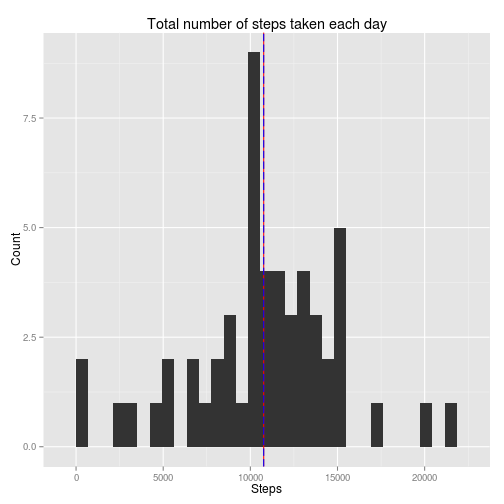
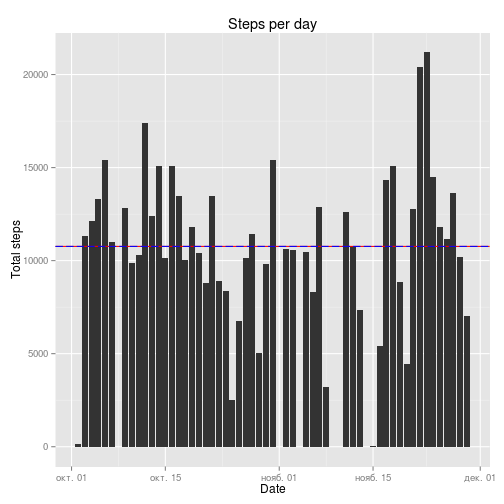
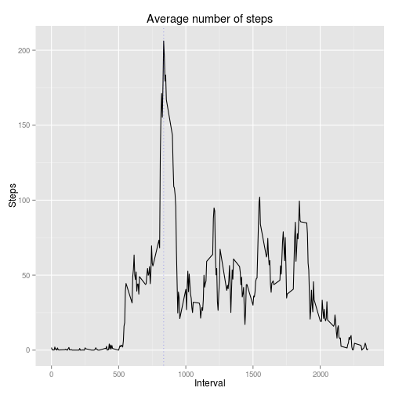
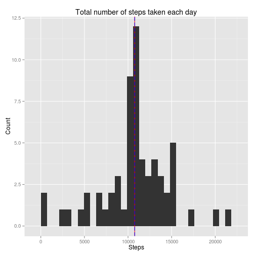
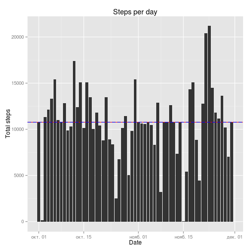
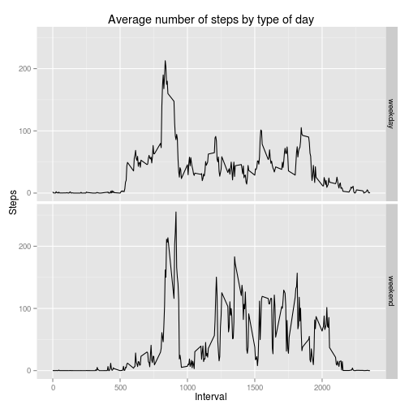

## Libraries

Loading some libraries we are going to use first.

```r
library(dplyr)
library(ggplot2)
```


## Loading and preprocessing the data

Unziping and loading data into the data frame "data".

```r
unzip("activity.zip")
data <- read.csv("activity.csv", colClasses = c("numeric","character", "numeric"))
```

Setting dates to appropriate class.

```r
data$date <- as.Date(data$date, format = "%Y-%m-%d")
```


## What is mean total number of steps taken per day?

Making separate data frame with required data (total number of steps taken per day).

```r
total_per_day <- data %>% group_by(date) %>% summarise(total = sum(steps))
```

Getting mean and median.

```r
total_mean <- mean(total_per_day$total, na.rm = T)
total_median <- median(total_per_day$total, na.rm = T)
```

Plotting a histogram...

```r
  ggplot(data = total_per_day, aes(x=total)) + geom_histogram() +
    geom_vline(xintercept = total_mean, color = "red") +
      geom_vline(xintercept = total_median, color = "blue", linetype = "longdash") +
        xlab("Steps") + ylab("Count")+ ggtitle("Total number of steps taken each day") 
```

 

... and a barplot, just to see the difference.

```r
  ggplot(data = total_per_day, aes(x=date, y=total)) + geom_bar(stat="identity") +
    geom_hline(yintercept = total_mean, color = "red") +
      geom_hline(yintercept = total_median, color = "blue", linetype = "longdash") +
        xlab("Date") + ylab("Total steps")+ ggtitle("Steps per day")
```

 

You can see blue and red line on both plots.  
They are mean and median of the total number of steps taken per day.

```r
total_mean
```

```
## [1] 10766.19
```

```r
total_median 
```

```
## [1] 10765
```


## What is the average daily activity pattern?

Making one more separate data frame for average number of steps taken.

```r
act_patern <- data %>% group_by(interval) %>% summarise(avarage = mean(steps, na.rm = T))
```

Getting the interval containing the maximum number of steps.

```r
top_interval <- (filter(act_patern, avarage == max(act_patern$avarage)) %>% select(interval))[[1,1]]
top_interval
```

```
## [1] 835
```

And there is a plot.

```r
ggplot(data = act_patern, aes(x = interval, y = avarage)) + geom_line() + geom_vline(xintercept = top_interval, color = "blue", linetype = "dotted", alpha = 0.3) +
   xlab("Interval") + ylab("Steps")+ ggtitle("Average number of steps")
```

 


## Imputing missing values

There is only one column with missing values.

```r
colSums(is.na(data))
```

```
##    steps     date interval 
##     2304        0        0
```

Вesides, if we have missing values for a day, it's the whole day missing.

```r
temp_data <- data %>% group_by(date) %>% mutate(miss_data = sum(is.na(steps)))

  summary(temp_data$miss_data)
```

```
##    Min. 1st Qu.  Median    Mean 3rd Qu.    Max. 
##    0.00    0.00    0.00   37.77    0.00  288.00
```

```r
  unique(temp_data$miss_data)
```

```
## [1] 288   0
```
  
So we are going to use the mean for that 5-minute interval to fill in all of the missing values in the dataset.  
There is data set with the missing data filled in.

```r
data_full <- data  

    for (x in 1:nrow(data_full))
    {
      if (is.na(data_full$steps[x]))
      {
        data_full$steps[x] <- (filter(act_patern, interval == data_full$interval[x]))[[2]]
      }
    }
```

New mean and median.

```r
total_per_day_full <- data_full %>% group_by(date) %>% summarise(total = sum(steps))

total_mean_full <- mean(total_per_day_full$total, na.rm = T)
total_median_full <- median(total_per_day_full$total, na.rm = T)

total_mean_full
```

```
## [1] 10766.19
```

```r
total_median_full  
```

```
## [1] 10766.19
```

After filling missing values with the mean for that 5-minute interval they are equal!

```r
total_mean_full == total_median_full
```

```
## [1] TRUE
```

Plotting a new histogram...

```r
  ggplot(data = total_per_day_full, aes(x=total)) + geom_histogram() +
    geom_vline(xintercept = total_mean_full, color = "red") +
      geom_vline(xintercept = total_median_full, color = "blue", linetype = "longdash") +
        xlab("Steps") + ylab("Count")+ ggtitle("Total number of steps taken each day") 
```

 

... and a new barplot.

```r
  ggplot(data = total_per_day_full, aes(x=date, y=total)) + geom_bar(stat="identity") +
    geom_hline(yintercept = total_mean_full, color = "red") +
      geom_hline(yintercept = total_median_full, color = "blue", linetype = "longdash") +
        xlab("Date") + ylab("Total steps")+ ggtitle("Steps per day")
```

 


## Are there differences in activity patterns between weekdays and weekends?

Adding information about day type.  
Useing as.POSIXlt() insted of weekdays() to avoid problems with locales and languages.

```r
data_full <- data_full %>% mutate(type = ifelse(as.POSIXlt(date)$wday >= 6,"weekend","weekday"))
data_full$type <- factor(data_full$type)
```

And there is a plot for both types of days.

```r
act_patern_type <- data_full %>% group_by(type, interval) %>% summarise(avarage = mean(steps, na.rm = T))

    ggplot(data = act_patern_type, aes(x = interval, y = avarage)) + geom_line() + facet_grid(type ~ .) +
      xlab("Interval") + ylab("Steps")+ ggtitle("Average number of steps by type of day")
```

 


